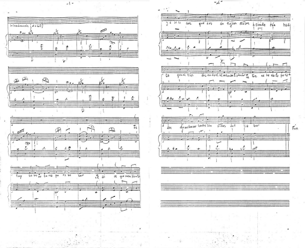

# Análisis de una pieza inédita de Gustavo «Cuchi» Leguizamón. Himno a la Universidad Nacional de Salta.
_Informe de peritaje de Pablo Herrera  sobre una pieza recobrada de la memoria de un hijo del «Cuchi» y de una partitura hallada en un expediente antiguo en la Universidad Nacional de Salta. Esta pieza está titulada  **Himno a la Universidad Nacional de Salta**._

## Código fuente
El presente repositorio contiene el código fuente del informe del Maestro **Pablo Herrera** titulado **Análisis de una pieza inédita de Gustavo «Cuchi» Leguizamón. Himno a la Universidad Nacional de Salta**. Escrito en LaTeX. 

Para ser compilado requiere tener instalado `texlive 2020` con el paquete el paquete `lyluatex` y utilizar el comando `lualatex --shell-espace herrera-teoria_himno_unsa.tex`. Es condición tener instalado y visible en el PATH [LilyPond](https://lilypond.org/) en su versión 2.22. Las versiones específicas de texlive y lilypond (un poco antiguas hoy) se exigen para evitar problemas con el espaciado horizontal de los fragmentos musicales que se observan con versiones más nuevas de LuaTeX y el paquete lyluatex.